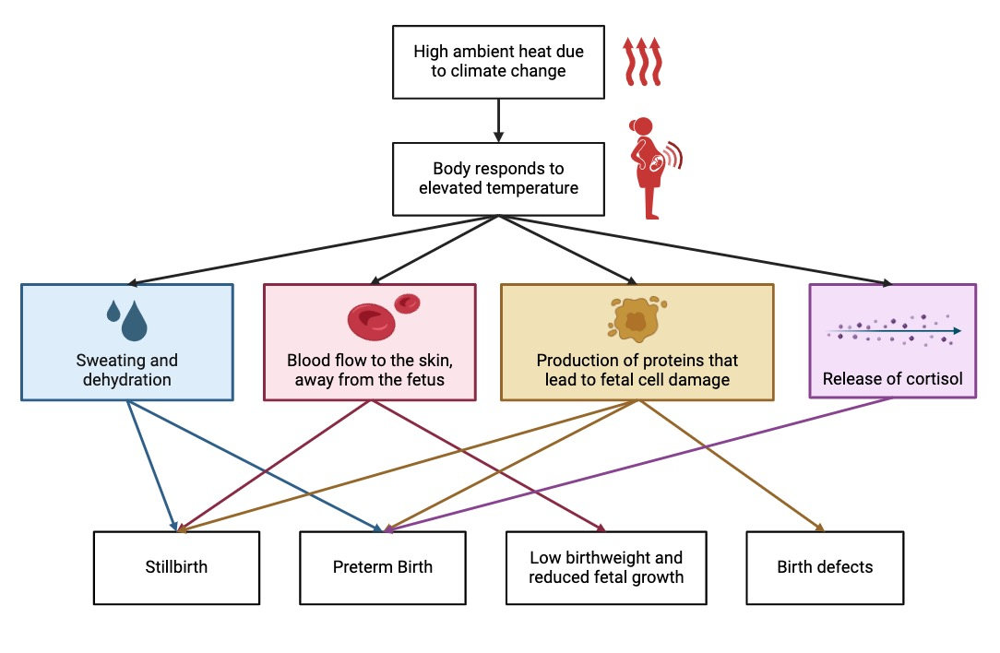

<h2 align="center">The Effect of Elevated Ambient Temperature on Prenatal Development: Executive Public Summary</h2>

#### INTRODUCTION
Climate change, marked by rising temperatures and increasingly frequent and severe heat events, is a growing threat to global health (Roos et al. 2021). Pregnant individuals are especially vulnerable, as physiological changes during pregnancy reduce heat tolerance. This increased sensitivity to elevated ambient temperatures can lead to disrupted fetal development. We review how heat exposure impacts prenatal development and highlight the need for targeted interventions.

#### METHODS
We used scoping review methods, conducting a comprehensive search of the literature for studies on both prenatal development and heat exposure. This yielded 72 original research articles and 35 review articles [(see dataset here)](106ReferenceList.md) which we analyzed numerically and by examining major themes. 

#### RESULTS
The included original research studies spanned 58 countries, although the majority were conducted in North America and Asia. Across these studies, 19 different adverse fetal developmental outcomes were found to be associated with heat exposure (Figure 1). Preterm birth, low birthweight, and stillbirth were the most commonly reported outcomes.

  
  ***Figure 1.** Adverse prenatal developmental outcomes associated with exposure to elevated ambient temperatures. These outcomes were all reported by the original research articles found in our literature search. 19 different outcomes were identified, with preterm birth being the most reported outcome.*

A variety of biological mechanisms for observed heat-related pregnancy outcomes were proposed by the articles reviewed (Figure 2). Heat exposure causes the body to produce heat-shock proteins that interfere with normal protein activity and cause cell damage, leading to growth restriction and birth defects (Roos et al. 2021). Blood flow is also redirected away from the uterus and placenta during heat exposure, which can impair fetal growth and cause stillbirth (Cowell et al. 2023). Dehydration from excess sweating increases risk of stillbirth, as it lowers levels of vital fluids surrounding the fetus (Samuels et al. 2022; Atkin et al. 2024). Heat stress also increases hormone levels, such as cortisol, which can trigger labour and cause preterm birth (Samuels et al. 2022; Atkin et al. 2024).

Many studies also identified the need for interventions to support pregnant individuals in the face of climate change, pointing to heat-resilient prenatal care and financial support for pregnant individuals as promising mitigation strategies. 

***Figure 2.** The primary biological mechanisms through which heat exposure can impact prenatal development and lead to adverse pregnancy outcomes.*

#### DISCUSSION
Our results indicate that elevated ambient temperatures have substantial and wide-ranging impacts on fetal development. We found a strong consensus within the literature that heat exposure is associated with preterm birth, stillbirth, and impaired fetal growth, highlighting these as key areas of concern amid a changing climate. While many studies emphasized the need for interventions to reduce the risk of heat stress to pregnant individuals, few concretely assessed which measures would be most valuable or how they should be implemented. Future research should determine the most feasible and effective approaches, as well as identify when during pregnancy preventive measures are needed most. We also found that the effect of heat exposure on prenatal development is understudied in lower income regions of the world, such as areas of Africa and South America. Future research should focus on these areas, since pregnant individuals may face heightened risks due to underdeveloped health infrastructure and warmer climates (Dalugoda et al. 2022; Dosio et al. 2018).

#### CONCLUSION
Protecting fetal health in a changing climate requires urgent action. It is essential to address gaps in medical interventions and ensure more inclusive global research. Future studies should focus on establishing geographically and culturally appropriate intervention strategies to safeguard future generations.

#### REFERENCES
Atkin, Kathryn, Georgina Christopulos, Rachel Turk, Jean M. Bernhardt, and Katherine Simmonds. 2024. “Educating Pregnant Women About the Dangers of Extreme Heat and Air Pollution.” *Journal of Obstetric, Gynecologic, and Neonatal Nursing: JOGNN* 53 (4): 438–46. https://doi.org/10.1016/j.jogn.2024.01.005.

Cowell, Whitney, Natasha Ard, Teresa Herrera, Eleanor A. Medley, and Leonardo Trasande. 2023. “Ambient Temperature, Heat Stress and Fetal Growth: A Review of Placenta-Mediated Mechanisms.” *Molecular and Cellular Endocrinology* 576 (October):112000. https://doi.org/10.1016/j.mce.2023.112000.

Dalugoda, Yohani, Jyothi Kuppa, Hai Phung, Shannon Rutherford, and Dung Phung. 2022. “Effect of Elevated Ambient Temperature on Maternal, Foetal, and Neonatal Outcomes: A Scoping Review.” *International Journal of Environmental Research and Public Health* 19 (3): 1771. https://doi.org/10.3390/ijerph19031771.

Dosio, Alessandro, Lorenzo Mentaschi, Erich Markus Fischer, and Klaus Wyser. 2018. “Extreme Heat Waves under 1.5°C and 2°C Global Warming.” *Environmental Research Letters,* April. https://doi.org/10.1088/1748-9326/aab827.

Roos, Nathalie, Sari Kovats, Shakoor Hajat, Veronique Filippi, Matthew Chersich, Stanley Luchters, Fiona Scorgie, Britt Nakstad, Olof Stephansson, and CHAMNHA Consortium. 2021. “Maternal and Newborn Health Risks of Climate Change: A Call for Awareness and Global Action.” *Acta Obstetricia Et Gynecologica Scandinavica* 100 (4): 566–70. https://doi.org/10.1111/aogs.14124.

Samuels, Louisa, Britt Nakstad, Nathalie Roos, Ana Bonell, Matthew Chersich, George Havenith, Stanley Luchters, et al. 2022. “Physiological Mechanisms of the Impact of Heat during Pregnancy and the Clinical Implications: Review of the Evidence from an Expert Group Meeting.” *International Journal of Biometeorology* 66 (8): 1505. https://doi.org/10.1007/s00484-022-02301-6.
